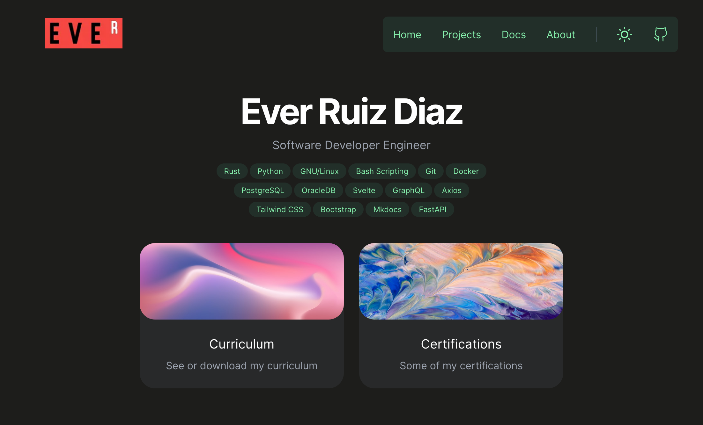

# Portfolio v3

Personal project made for didactic purposes



## Powered by ⚡️

- [FastAPI](https://fastapi.tiangolo.com/)
- [Svelte](https://svelte.dev/)
- [GraphQL](https://graphql.org/)
- [PostgreSQL 14](https://www.postgresql.org/)
- [TailwindCSS](https://tailwindcss.com/docs/installation)

## Commands 👾

```bash
uvicorn main:app --reload  # Run server
sh run_be.sh               # Run backend
sh run_fe.sh               # Run frontend
```

## Docs 📄

- [API](http://localhost:8000/docs)
- [GraphQL tool](http://localhost:8000/graphql)
- [Svelte](https://kit.svelte.dev/docs/introduction)
- [Svelte Routing](https://github.com/EmilTholin/svelte-routing#readme)
- [FastAPI](https://fastapi.tiangolo.com/)
- [Strawberry](https://strawberry.rocks/docs/integrations/fastapi)
- [TailwindCSS](https://tailwindcss.com/docs/installation)

## Endpoints 🌎

Test connection and get data of PostgreSQL 14

- [Test DB normal](http://127.0.0.1:8000/db)
- [Test DB async](http://127.0.0.1:8000/db/async)
- [Test DB async v2](http://127.0.0.1:8000/db/async/v2)
